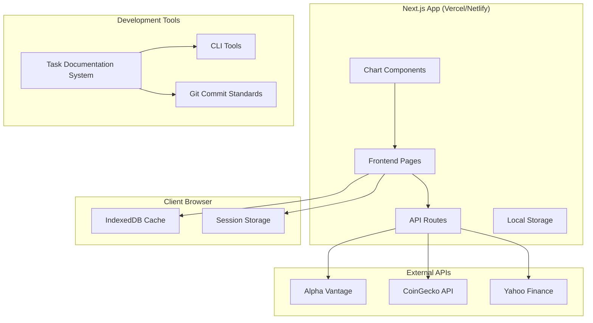

# 系統設計 (System Design)

## 系統架構圖 (System Architecture Diagram)



## 技術棧 (Technology Stack)

**全端框架:**
- Next.js 14 + TypeScript - 全端React框架，支援API Routes
- Vercel 或 Netlify - 免費託管平台

**前端技術:**
- React 18 + TypeScript
- TanStack Query - 資料獲取、快取和同步
- Lightweight Charts (TradingView) - 專業K線圖表庫
- Tailwind CSS - UI樣式框架
- Zustand - 輕量級狀態管理

**資料存儲:**
- IndexedDB - 瀏覽器端資料庫（追蹤清單、快取）
- Session Storage - 臨時資料存儲
- Local Storage - 使用者偏好設定

**部署和託管:**
- Vercel (推薦) - 原生支援Next.js，免費額度充足
- Netlify - 替代選擇，同樣支援Next.js

## 組件與介面 (Components and Interfaces)

### API Routes (Next.js)

```typescript
// Next.js API Routes
/api/stocks/search             # 搜尋股票
/api/stocks/[symbol]           # 獲取股票詳情和價格
/api/crypto/search             # 搜尋加密貨幣
/api/crypto/[symbol]           # 獲取加密貨幣詳情和價格
/api/charts/[symbol]           # K線圖歷史資料
```

### 客戶端服務 (Client-Side Services)
- **StockService**: 處理美股資料獲取和本地快取
- **CryptoService**: 處理加密貨幣資料獲取和本地快取
- **WatchlistService**: 管理本地追蹤清單（IndexedDB）
- **ChartService**: 提供K線圖資料和快取管理

### 外部 API 整合 (External API Integrations)
- **AlphaVantageClient**: 美股即時和歷史資料（透過API Routes）
- **CoinGeckoClient**: 加密貨幣價格和市場資料（透過API Routes）
- **YahooFinanceClient**: 備用資料源（透過API Routes）

### 前端組件 (Frontend Components)

#### 核心組件 (Core Components)
- **Dashboard**: 主要儀表板顯示追蹤清單
- **SearchBar**: 股票/加密貨幣搜尋功能
- **WatchlistTable**: 追蹤清單表格顯示
- **PriceCard**: 個別資產價格卡片
- **ChartModal**: K線圖表彈出視窗

#### 圖表組件 (Chart Components)
- **CandlestickChart**: K線圖表組件
- **TimeRangeSelector**: 時間範圍選擇器
- **TechnicalIndicators**: 技術指標顯示
