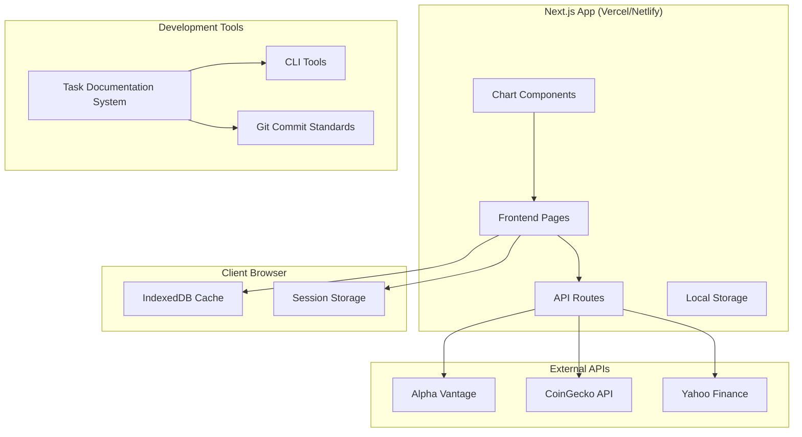

# AGENTS.md - AI Agent Onboarding Guide

**歡迎！** 這個檔案是為 AI 開發代理設計的專案說明文件。它包含了開始在這個專案上工作所需的所有關鍵資訊。請在開始任何任務之前仔細閱讀並理解所有章節。

---

## 1. 專案概觀 (Project Overview)

這是一個股票價格追蹤網站，讓使用者可以追蹤美股和加密貨幣的價格及K線圖表。系統採用 Next.js 全端架構，部署在免費託管平台（Vercel 或 Netlify），並使用瀏覽器本地存儲（IndexedDB）來管理使用者資料，以降低複雜度和維護成本。未來的目標是支援台股市場的擴展。

---

## 2. 核心指令與約束 (Core Mandates & Constraints)

**這是專案中最重要的部分。所有貢獻都必須嚴格遵守以下規則。**

### 2.1. Git 提交標準 (Git Commit Standards) - 🚨 強制執行

- **🚨 絕對天條：所有 Git commit 訊息都【必須】使用繁體中文，【絕對禁止】使用英文。**
- **任務相關提交格式**: `feat(task-X): 中文標題`
- **一般提交格式**: `feat: 中文標題`
- **提交訊息內文 (Body)**:
    - 必須使用條列式中文詳細說明。
    - 必須包含 `對應需求: X.X`。
    - 必須包含 `相關檔案: path/to/files`。
    - 必須包含 `Co-authored-by: AI Assistant <ai@kiro.dev>` 標籤，且內容完全一致。

#### 提交類型 (Commit Types)
- `feat(task-XX)`: 新功能實作
- `fix(task-XX)`: 錯誤修復
- `refactor(task-XX)`: 程式碼重構
- `test(task-XX)`: 測試相關
- `docs(task-XX)`: 文件更新
- `style(task-XX)`: 程式碼格式調整
- `chore(task-XX)`: 建置或輔助工具變動
- `perf(task-XX)`: 效能優化

### 2.2. 程式碼品質標準 (Code Quality Standards)

- 所有程式碼提交前，必須通過 TypeScript 編譯檢查 (`tsc --noEmit`)。
- 所有程式碼必須通過 ESLint 品質檢查 (`eslint .`)。
- 所有新功能必須包含足夠的單元測試（使用 Vitest 和 React Testing Library）。
- 必須實作完整的錯誤處理機制，並提供使用者友善的錯誤訊息。

### 2.3. 文件化要求 (Documentation Requirements)

- **每個任務完成後，必須自動化生成以下文件**：
    1.  **任務文件**: 在 `docs/tasks/` 目錄下，記錄詳細的實作流程、技術決策和測試結果。
    2.  **Git 提交記錄**: 在 `docs/git-commits/` 目錄下，整理該任務相關的所有 Git commit。
    3.  **更新開發日誌**: 更新 `docs/development-log.md` 以反映最新進度。

---

## 3. 使用者需求 (User Requirements)

- **Req 1**: 追蹤美股價格。
- **Req 2**: 追蹤加密貨幣價格。
- **Req 3**: 查看股票和加密貨幣的 K 線圖。
- **Req 4**: 提供直觀、響應式的網頁介面。
- **Req 5**: 從可靠的外部 API 獲取資料。
- **Req 6**: 採用 Next.js 全端架構，並使用免費託管服務。
- **Req 7**: 架構需支援未來擴展（如台股）。
- **Req 8**: 每個任務完成後需有詳細的製作流程文件和 Git 記錄。
- **Req 9**: 遵循嚴格的程式碼品質和中文提交規範。

---

## 4. 系統架構 (System Architecture)

### 4.1. 技術棧 (Technology Stack)

- **全端框架**: Next.js 14 + TypeScript
- **前端技術**: React 18, TanStack Query, Zustand, Tailwind CSS
- **圖表庫**: Lightweight Charts (TradingView)
- **資料存儲**: IndexedDB (用於追蹤清單和快取), Local/Session Storage
- **測試**: Playwright (E2E), Vitest, React Testing Library (單元/組件)
- **部署**: Vercel / Netlify

### 4.2. 架構圖 (Architecture Diagram)



### 4.3. API 端點 (API Endpoints)

- `/api/stocks/search`: 搜尋股票
- `/api/stocks/[symbol]`: 獲取股票詳情
- `/api/crypto/search`: 搜尋加密貨幣
- `/api/crypto/[symbol]`: 獲取加密貨幣詳情
- `/api/charts/[symbol]`: 獲取 K 線圖歷史資料

### 4.4. 資料模型 (Data Models)

```typescript
// 主要資料介面
interface Asset {
  symbol: string;
  name: string;
  assetType: 'stock' | 'crypto';
  exchange?: string;
}

interface PriceData {
  price: number;
  volume?: number;
  marketCap?: number;
  change24h?: number;
  timestamp: Date;
}

interface CandlestickData {
  openPrice: number;
  highPrice: number;
  lowPrice: number;
  closePrice: number;
  volume: number;
  timestamp: Date;
}

interface WatchlistItem {
  asset: Asset;
  currentPrice?: PriceData;
  addedAt: Date;
}
```

### 4.5. IndexedDB 結構 (IndexedDB Schema)

- **`watchlist`**: 儲存使用者追蹤的資產。
- **`priceCache`**: 快取資產的即時價格。
- **`chartCache`**: 快取 K 線圖資料。

---

## 5. 開發工作流程 (Development Workflow)

### 5.1. 測試策略 (Testing Strategy)

- **單元測試 (Unit Tests)**: 使用 Vitest 測試服務、Hooks 和工具函數。API Routes 的覆蓋率目標 >80%。
- **組件測試 (Component Tests)**: 使用 React Testing Library 測試 UI 組件。核心組件覆蓋率目標 >70%。
- **端到端測試 (E2E Tests)**: 使用 Playwright 測試關鍵使用者流程（如搜尋、新增、查看圖表）。

### 5.2. 錯誤處理 (Error Handling)

- **API 錯誤**: 實作重試機制和備用資料源。
- **網路錯誤**: 提供離線模式和快取資料回退。
- **前端錯誤**: 使用全域錯誤邊界 (Error Boundary) 捕捉並顯示友善訊息。
- **API 速率限制**: 透過智能請求排程和使用者提示來管理。

### 5.3. AI 驅動的文件化流程 (AI-Driven Documentation)

本專案採用 AI 驅動的文件生成系統。當一個任務完成時，AI 代理應：
1.  分析任務中的程式碼變更。
2.  自動生成詳細的任務文件 (`docs/tasks/task-XX.md`)。
3.  自動生成標準化的 Git 提交記錄文件 (`docs/git-commits/task-XX.md`)。
4.  自動更新開發日誌 (`docs/development-log.md`)。

---

## 6. 實作計畫與任務 (Implementation Plan & Tasks)

- [x] 1. 建立Next.js專案基礎架構
- [x] 2. 實作資料模型和TypeScript介面
- [x] 3. 建立IndexedDB資料存儲服務
- [x] 4. 實作外部API整合服務
- [x] 5. 建立Next.js API Routes
- [x] 6. 建立狀態管理和資料服務
- [x] 7. 實作核心UI組件
- [x] 8. 實作K線圖表功能
- [x] 9. 建立主要頁面和路由
- [x] 10. 實作UI樣式和使用者體驗
- [x] 11. 實作錯誤處理和使用者反饋
- [ ] 12. 實作效能優化和快取策略
- [x] 13. 撰寫測試程式碼
- [ ] 14. 準備部署和上線
- [ ] 15. 建立未來擴展基礎
- [x] 16. 建立任務文件化系統
